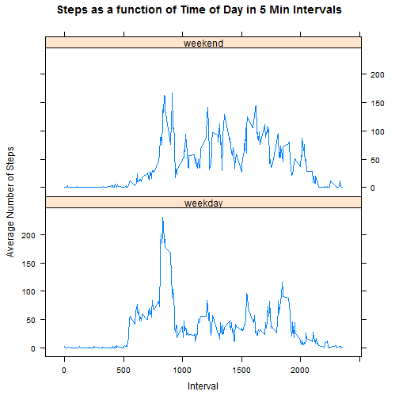

##title: "Reproducible Research - Project 1"  
author: "Eugene"  
date: "20 September 2015"  


##Loading the Data


```r
activity <- read.csv("activity.csv")
```

##Histogram of the Mean Total Number of Steps Taken per Day


```r
daySteps <- aggregate(steps ~ date, data=activity, sum)

hist(daySteps$steps, 
     breaks=10, 
     col="cornflowerblue", 
     xlab = "No. of Steps per Day", 
     main = "Histogram of Steps per Day")
```

 

##The Mean and Median of the Total Number of Steps Taken per Day


```r
mean(daySteps$steps)
```

```
## [1] 10766.19
```

```r
median(daySteps$steps)
```

```
## [1] 10765
```

##Calculation of the Average Daily Activity Pattern in Five Minute Intervals


```r
intervalSteps <- aggregate(steps ~ interval, data=activity, mean)
minute <- intervalSteps$interval%%100
hour <- as.integer(intervalSteps$interval/100)
new <- cbind(intervalSteps, hour, minute)
x <- paste(hour, minute, sep=":")
new2 <- cbind(new, x)
new2$y <- as.POSIXlt(new2$x, format = "%H:%M")
plot(new2$y, new2$steps,type="l", xlab = "", ylab="")
title(xlab = "Time of Day (HH:MM)",
      ylab = "Average Number of Steps", 
      col.lab = "red",
      main = "Steps as a function of Time of Day in 5 Min Intervals",
      col.main = "blue")
```

 

##The Five Minute Interval with The Maximum Average Number of Steps is...


```r
format(new2$y[which.max(new2$steps)], "%H:%M")
```

```
## [1] "08:35"
```

##Replacing Missing (NA) Values  
Missing Values in the dataset are replaced with the interval average across all days. The total number of missing values is:


```r
format(new2$y[which.max(new2$steps)], "%H:%M")
```

```
## [1] "08:35"
```

A new histogram of the mean total number of steps taken per day with the filled in missing values


```r
cleanActivity <- transform(activity, 
                           steps = ifelse(is.na(activity$steps), 
                           new2$steps[match(activity$interval, 
                           new2$interval)], 
                           activity$steps))

daySteps <- aggregate(steps ~ date, data=cleanActivity, sum)

hist(daySteps$steps, 
     breaks=10, 
     col="cornflowerblue", 
     xlab = "No. of Steps per Day", 
     main = "Histogram of Steps per Day")
```

 

The new mean and median are:


```r
mean(daySteps$steps)
```

```
## [1] 10766.19
```

```r
median(daySteps$steps)
```

```
## [1] 10766.19
```

Replacing the missing values has only a small impact on median and an even smaller one on mean.  

##Are there Differences Between Activity Patterns on the Weekend Compared to Weekdays


```r
library(lattice)
cleanActivity$days <- weekdays(as.Date(cleanActivity$date))
cleanActivity$week <- "weekday"
index <- cleanActivity$days %in% c("Saturday", "Sunday")
cleanActivity$week[index] <- "weekend"

intervalSteps <- aggregate(steps ~ interval + week, data=cleanActivity, mean)
minute <- intervalSteps$interval%%100
hour <- as.integer(intervalSteps$interval/100)
new <- cbind(intervalSteps, hour, minute)
x <- paste(hour, minute, sep=":")
new2 <- cbind(new, x)
new2$y <- as.POSIXlt(new2$x, format = "%H:%M")


xyplot(new2$steps ~ new2$interval|new2$week, 
       xlab = "Interval",
       ylab = "Average Number of Steps", 
       main = "Steps as a function of Time of Day in 5 Min Intervals",
       type = "l")
```

 


